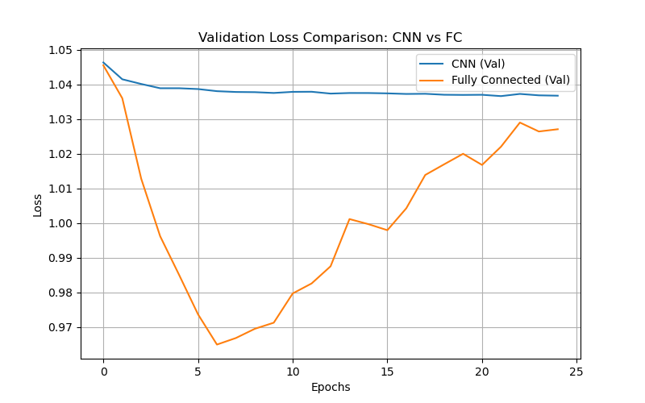
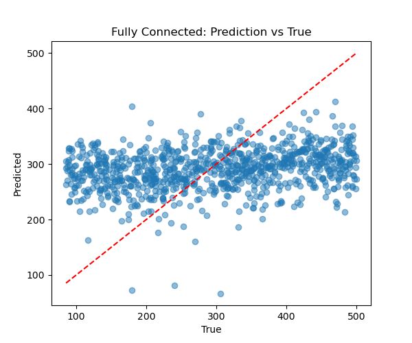

# Particle Mass Regression using Deep Learning

## Overview

This project focuses on regressing particle mass from high-dimensional jet images using deep learning models. The dataset consists of multi-channel images representing detector-level features, and the goal is to predict the mass (am) of particles based on these inputs.

Two architectures were explored:

Convolutional Neural Network (CNN) – to capture spatial patterns

Fully Connected Network (FCNN) – to learn global feature relationships

Beyond model implementation, the project emphasizes understanding model behavior, identifying limitations, and evaluating generalization performance in the context of scientific machine learning.


## Dataset Description

- Input shape: **(4, 125, 125)** jet images  
- Channels: Track pT, DZ, D0, ECAL  
- Target: Particle mass (`am`)  
- Dataset size: ~2000–3000 samples  

The dataset presents a challenging scenario due to:
- High dimensionality (~62,500 features per sample)  
- Limited number of samples  
- Potential risk of overfitting  


## Methodology

### Data Preprocessing

- Standardization of input features:
  
  X = (X - mean) / std  

- Target normalization for stable training  
- Train-validation split: **80% / 20%**


## Models Implemented

### 1. Convolutional Neural Network (CNN)

- Designed to capture spatial relationships in jet images  
- Consists of convolutional, activation, and pooling layers  

### 2. Fully Connected Neural Network (FC)

- Flattened input representation  
- Dense layers with ReLU activation  
- Dropout for regularization  


## Training Strategy

- Loss Function: Mean Squared Error (MSE)  
- Optimizer: Adam  
- Regularization:
  - Dropout (FC model)
  - Weight decay  
- Early stopping:
  - Best model selected based on validation loss  


## Results

### Validation Loss Comparison



---

### Prediction vs True Values (Fully Connected Model)




### Quantitative Metrics

| Model | RMSE | MAE | R² Score |
|------|------|------|---------|
| CNN | 119.82 | 103.89 | -0.0007 |
| Fully Connected | **116.29** | **99.02** | **0.0573** |


## Analysis

### CNN Model

- Training and validation loss remained nearly constant  
- Predictions collapsed to near-constant values  
- Indicates **underfitting**  
- Suggests inability to learn meaningful spatial features from limited data  

---

### Fully Connected Model

- Training loss decreased significantly  
- Validation loss increased over epochs  
- Indicates **overfitting**, but model successfully learned patterns  


### Key Observations

- High-dimensional inputs with limited data lead to generalization challenges  
- CNNs require larger datasets to effectively learn spatial representations  
- Fully connected models learn faster but tend to overfit  

---

## Overfitting Control

To mitigate overfitting, the following techniques were applied:

- Train-validation split  
- Dropout regularization  
- Weight decay  
- Early stopping (best model checkpointing)  

Despite these measures, some overfitting persists due to dataset limitations, reflecting real-world challenges in scientific ML.

---

## Model Selection

The **Fully Connected model** was selected for deployment as it demonstrated better learning capability compared to the CNN model.

---

## Deployment (ONNX Conversion)

The selected model was exported to ONNX format to enable integration with external frameworks such as CMSSW.

- PyTorch → ONNX conversion completed successfully  
- Ensures interoperability for inference pipelines  

---

## CMSSW Integration (Conceptual)

- ONNX model can be loaded using ONNX Runtime in CMSSW
- Enables:
 -- Fast inference inside high-energy physics pipelines
 -- Integration with existing CMS workflows
Inference Pipeline:
- Load ONNX model
- Preprocess input jet images
- Run inference
- Output predicted mass

The deployment workflow includes:

- Setting up CMSSW environment using Docker  
- Integrating ONNX model into inference pipeline  
- Running inference using CMS tools  

Due to environment constraints, full CMSSW execution was not performed locally. However, the pipeline and integration steps were clearly outlined.

---

## Challenges

- Handling high-dimensional input (4×125×125)
- Balancing underfitting vs overfitting
- Choosing appropriate architecture for non-natural images
- Managing large dataset size during training
- Saving and organizing outputs for reproducibility

---

## Conclusion

- FCNN outperformed CNN for this task
- CNN struggled due to lack of strong spatial structure
- Regularization improved stability but did not fully eliminate overfitting

This project demonstrates the importance of:

- Understanding data characteristics
- Choosing architecture accordingly
- Analyzing learning behavior, not just metrics

The comparison between CNN and fully connected architectures highlights the importance of aligning model complexity with data characteristics.

Additionally, the ONNX conversion and deployment discussion provide insight into real-world machine learning integration within experimental physics frameworks.

---

## Future Work

- Increase dataset size to improve generalization  
- Explore advanced architectures (ResNet, attention models)  
- Perform detailed error analysis  
- Complete full CMSSW inference pipeline  
- Optimize model for inference latency  

---

## Key Takeaways

- Model performance is strongly dependent on data characteristics  
- Understanding model failure is as important as achieving performance  
- Regularization techniques help but cannot fully overcome data limitations  
- Deployment is a critical component of the ML pipeline  

---

## How to Run

1. Clone the repository
   
   ```
   git clone https://github.com/your-username/your-repo-name.git
   cd your-repo-name

3. Install dependencies
   
   ```
   pip install -r requirements.txt

5. Add Dataset
   
Download the dataset - The dataset is not included in this repository due to size constraints. 
Please download it from the official source (https://cernbox.cern.ch/s/zUvpkKhXIp0MJ0g
) or provide your own dataset in the required format.
Place it inside the data/ folder
data/
└── dataset.npy   # or your dataset files

5. Run the Project

Using Jupyter Notebook:

    ```
    jupyter notebook

Open the notebook and run all cells.

6. Outputs

Results (plots & model) will be saved in:

    ```
    results/
